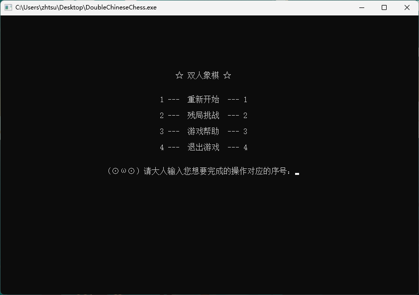
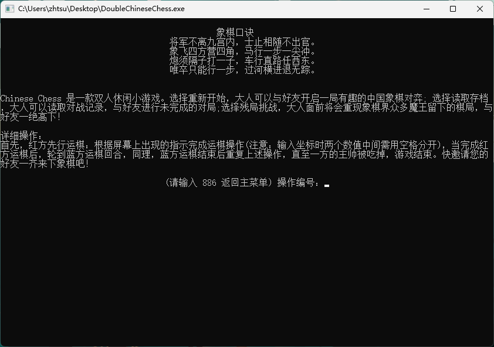
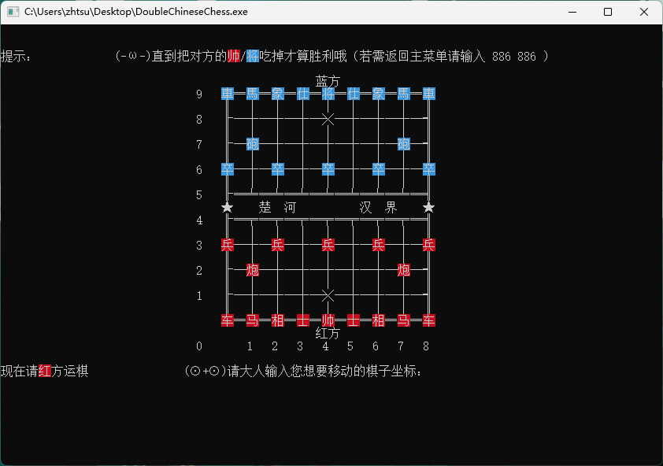
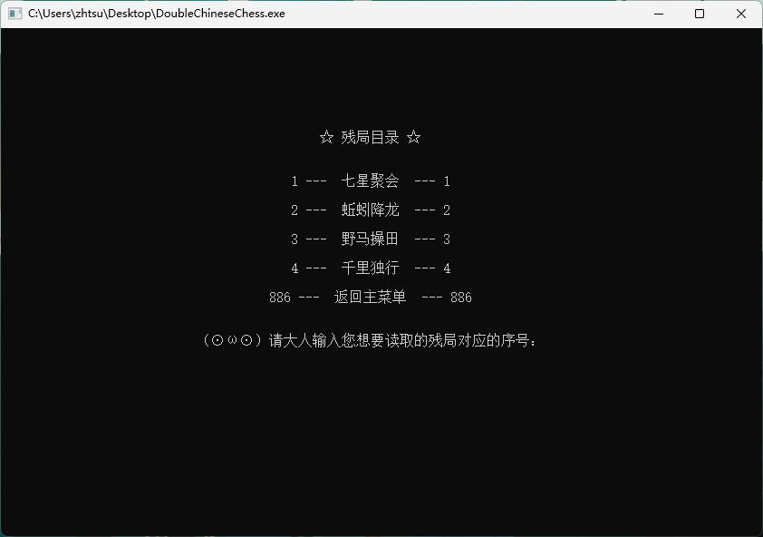

# DoubleChineseChess

A double chinese chess game in console that coded in pure C. This is my final assignments for the first-year C course.

# IDE

Dev-C++

# Screenshots

### Main Menu

### Help

### Game

### Challenge

